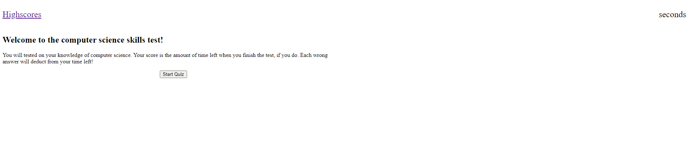

# Comp-Sci-Skills-Test

Constructing a quiz to test ones knowledge of computer science

## Criteria

* Upon pressing start button, timer starts and a question is presented

* After answering a question, another question is presented

* Upon incorrect answer, time is deducted from the clock/score

* The game ends when the timer hits 0 or all the questions are answered

* Allows user to save initials and score

## Website

https://northernpines.github.io/Comp-Sci-Skills-Test/

